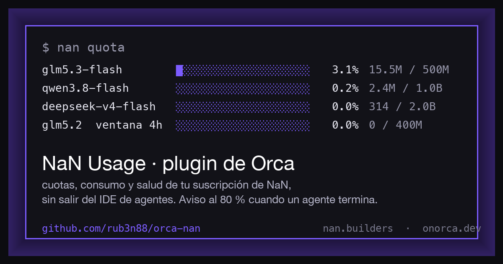

# orca-nan



Tu suscripción de [NaN](https://nan.builders) —cuotas, consumo, modelos, salud— sin salir de
[Orca](https://www.onorca.dev), el IDE de agentes. Dos piezas que se complementan:

- **`nan`**, un script de terminal (Python 3, sin dependencias).
- **NaN Usage**, un plugin de Orca: comandos en la paleta, aviso cuando un modelo pasa del 80 %
  justo al terminar un agente, y un panel que lanza `nan` en tu terminal.

> *Your NaN subscription (quotas, usage, models, health) inside Orca, the agent IDE. A terminal
> script plus an Orca plugin. Spanish UI; the code is commented in Spanish too.*

## Requisitos

- Suscripción de NaN con API key (tier *inference*).
- La key en `~/.config/nan/api-key` (`chmod 600`) o en `$NAN_API_KEY`.
- Para el plugin: Orca ≥ 1.4 con **Settings → Plugins (Experimental)** activado.

## `nan` — el script

```sh
ln -s "$PWD/bin/nan" ~/.local/bin/nan     # o cualquier carpeta del PATH
```

```
nan quota              cuota por modelo (usado / cap / reset)
nan usage              consumo 24h · mes · 30d · total, por modelo
nan models             modelos servidos ahora mismo + cuota + notas
nan billing            estado de la suscripción
nan ping [modelo...]   latencia al primer token y qué modelo ha servido de verdad
nan status             una línea, para tu prompt o statusline
nan config <destino>   snippet listo para pegar: env | opencode | pi | cursor | zed
nan --json <cmd>       salida JSON cruda
```

```
$ nan quota
periodo desde 2026-09-01
  glm5.3-flash         █░░░░░░░░░░░░░░░░░░░   3.1%    15.5M / 500.0M reset 28d
  qwen3.8-flash        ░░░░░░░░░░░░░░░░░░░░   0.2%     2.4M / 1.00B  reset 28d
  glm5.2               ░░░░░░░░░░░░░░░░░░░░   0.0%        0 / 3.00B  reset 2d  ventana 4h: 400.0M

$ nan ping
  qwen3.8-flash        ok    1.10s primer token
  glm5.3-flash         ok    9.36s primer token
  deepseek-v4-flash    ok    1.56s primer token
```

`ping` avisa si el modelo que responde no es el que pediste (NaN puede degradar de modelo sin
error). `config` genera los snippets con los modelos que hay *ahora*, no con una lista pegada.

## NaN Usage — el plugin de Orca

| Dónde | Qué |
|---|---|
| ⌘J → «NaN: …» | **cuota por modelo** (⌘⌥U) · **consumo 24h / mes** · **modelos disponibles** · **suscripción** · **comprobar umbral 80 %** — como notificación de escritorio |
| Automático | Cuando un agente pasa a `done`, mira la cuota (máx. 1 vez / 10 min) y avisa si algún modelo supera el 80 %. Un aviso por modelo y periodo |
| Panel «NaN» (barra derecha) | Botones que escriben `nan quota`, `nan ping`, `nan config …` en la terminal que elijas |

### Instalar (y que se actualice solo)

1. Settings → **Plugins (Experimental)** → activa *Plugin system*.
2. En **Marketplaces** → *Add* → pega `https://github.com/rub3n88/orca-nan.git`. Este repo es a la vez
   plugin y marketplace (lleva su propio `orca-marketplace.json`).
3. Busca **NaN Usage** en la lista, *Install*, y acepta las capacidades que pide: `workspace:read`,
   `terminal:send`, `notifications:show`, `storage`, `events:subscribe`.
4. Deja la key en `~/.config/nan/api-key` (`chmod 600`). El worker la lee de ahí porque su entorno
   está saneado y no hereda variables.

**Actualizar:** cuando haya versión nueva, en Settings → Plugins te aparecerá **Update** junto al
plugin (Orca refresca el marketplace y compara). No hace falta desinstalar; solo vuelve a pedir
consentimiento si cambian las capacidades. *Roll back* deshace la última actualización.

**Para desarrollarlo:** Settings → Plugins → *Development* → añade la carpeta del repo. Orca vigila
los ficheros y recarga sola al guardar; no lo tengas a la vez que la instalación de marketplace.

### Usar el panel

El panel no puede hacer red ni conoce los nombres de tus terminales (la API v0 solo da su orden),
y el orden de la lista no es el de tus pestañas), así que: pulsa **Identificar** y el panel escribe
`# NaN -> terminal N` (sin Enter) en cada terminal del worktree. Mira tu terminal de shell, elige ese
número en *Ejecutar en* y ya: cada botón escribe `nan …` ahí y pulsa Enter. La elección se recuerda
por worktree. Las terminales de agentes suelen rechazar la escritura; si no, borra la marca con ⌃U.

El atajo ⌘⌥U solo dispara con el foco fuera de una terminal (dentro, Orca deja las teclas al PTY;
usa ⌘J). Se puede cambiar en Settings → Shortcuts, grupo «Plugins».

## Cómo funciona (y por qué así)

La misma API key de inferencia autentica `cloud-api.nan.builders`, el backend del panel web de
NaN, que es donde viven cuotas, consumo y billing. Esas rutas no están documentadas: pueden cambiar.

El sistema de plugins de Orca (v0) no tiene barra de estado, ni canal worker → panel, ni permiso de
red declarable todavía. De ahí el reparto: el worker (Node, fuera de proceso) hace las llamadas y
notifica; el panel, que no puede hacer red, delega en el script. Cuando Orca añada `net:fetch`
habrá que declararlo y volver a consentir. Contexto completo y plan en [`docs/NOTAS.md`](docs/NOTAS.md).

## Desarrollo

```sh
ELECTRON_RUN_AS_NODE=1 /Applications/Orca.app/Contents/MacOS/Orca scripts/test-worker.mjs
```

Ejecuta los comandos del worker con el Node del propio Orca contra la API real, simulando el
objeto `orca` que inyecta el host. `scripts/panel-preview.html` previsualiza el panel en un navegador
normal simulando el bridge del host.

MIT · [Rubén León](https://github.com/rub3n88) · hecho para la comunidad de NaN
